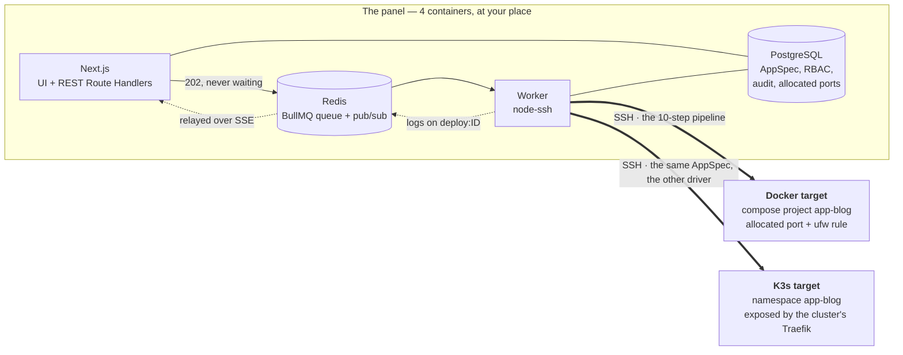

# Pupitre

**A self-hosted control plane that deploys your applications to your machines,
over SSH, with Docker Compose *or* K3s — from the same description.**

You write an `AppSpec`: a JSON document that describes *what* the application is,
and that knows neither Docker nor Kubernetes. The driver translates it into a
`compose.yml` or into Kubernetes manifests at deployment time. Switching runtime
means switching target machine — not rewriting the application.

The rest — RBAC, audit log, blocking vulnerability scans, automatic rollback,
monitoring, notifications — exists because a tool that holds your SSH keys has
no right to be approximate.

## In ten seconds

```json
{
  "name": "blog",
  "version": "1.4.2",
  "services": [
    {
      "name": "web",
      "source": { "type": "image", "ref": "ghcr.io/example/blog:1.4.2" },
      "port": 8080,
      "exposed": true,
      "env": { "DATABASE_HOST": "db", "DATABASE_NAME": "blog" },
      "secrets": ["DATABASE_PASSWORD"],
      "healthcheck": { "path": "/healthz", "retries": 5 },
      "resources": { "cpuMilli": 500, "memoryMi": 512 },
      "dependsOn": ["db"]
    },
    {
      "name": "db",
      "source": { "type": "image", "ref": "postgres:16-alpine" },
      "port": 5432,
      "exposed": false,
      "env": { "POSTGRES_DB": "blog", "POSTGRES_USER": "blog" },
      "secrets": [{ "name": "POSTGRES_PASSWORD", "from": "DATABASE_PASSWORD" }],
      "volumes": [
        { "name": "data", "mountPath": "/var/lib/postgresql/data", "size": "10Gi" }
      ]
    }
  ],
  "ingress": { "host": "blog.example.com", "tls": true, "targetService": "web" }
}
```

No field of this file belongs to a runtime. No `restart_policy`, no
`image_pull_policy`, no `namespace`: what the spec cannot say, the driver
decides. You can check it without deploying anything, or even owning a machine:

```bash
pnpm tsx scripts/render-both.ts my-spec.json
```

For this spec, the output is a Compose project `app-blog` with two services, and
an `app-blog` namespace of ten manifests — `Namespace`, two `ConfigMap`, two
`Secret`, one `PersistentVolumeClaim`, two `Deployment`, two `Service`. The
domain `blog.example.com` is not rendered by the driver: it is a route, set by
the target's reverse proxy at deployment time — a file for Traefik on Docker, an
`Ingress` for the K3s one.

A detail that is not one: `POSTGRES_PASSWORD` **is** `DATABASE_PASSWORD`. An
application and its database often expect the same password under two names;
`from` says "this name designates the value of that name". There is a single
secret, a single row in the database, a single value — and it is encrypted.

---

## This panel hosts nothing. It orchestrates.

It is the most frequent confusion, so let us clear it up right away: deployed
applications never live in the panel. They live on the target machines, and
would keep running if the panel stopped.

|  | The panel | The target machines |
|---|---|---|
| What it is | 4 containers on your workstation or an admin server | VMs or servers you already own |
| What runs there | Next.js, a worker, PostgreSQL, Redis | your applications |
| What to install there | nothing but Docker | nothing — the panel installs what it needs over SSH |
| If it is switched off | you can no longer deploy or monitor | the applications keep answering |

The path of a deployment, from the click to the URL:



An HTTP route enqueues and answers `202`. It never waits for an SSH session.

---

## Getting started

Prerequisites: Docker (with `compose`), and `jq` if you plan to run the
verification scripts. Node and pnpm are only needed for development.

```bash
cp .env.example .env
docker compose up -d --build
```

The panel applies the migrations, replays the RBAC seed, then turns `healthy`;
the worker only starts afterwards. Open <http://localhost:3000> — the database
is empty, so sign-up is open and **the first account created becomes an
administrator**. A setup guide takes over at the first sign-in: instance
identity, first target, role, user, security.

Check:

```bash
docker compose ps                        # 4 containers
curl -s http://localhost:3000/api/health # {"status":"ok","db":"ok","redis":"ok",...}
```

For anything beyond a local trial, regenerate both secrets before the first
start — `MASTER_KEY` encrypts the SSH credentials; it can be rotated later
(`crypto rotate`, see [docs/security.md](docs/security.md#rotating-master_key)),
but a key you lose takes everything it protects with it:

```bash
openssl rand -hex 32      # → MASTER_KEY
openssl rand -base64 48   # → BETTER_AUTH_SECRET
```

No VM at hand? The repository makes two, in containers:

```bash
./scripts/setup-test-target.sh   # Docker target (docker-in-docker), registered in the panel
```

The K3s target is set up by hand — see [`docs/getting-started.md`](docs/getting-started.md#the-k3s-test-target).

The rest of getting started — development mode, test targets, the full list of
commands — is in **[`docs/getting-started.md`](docs/getting-started.md)**.

---

## Why this one rather than another

Pupitre belongs to the same family as Coolify, Dokploy or CapRover: a panel you
host, which deploys to machines you own. It does not try to replace them, and on
several points it is plainly inferior to them. Here is the comparison as it
stands.

**What it does that you will not find in this family**

| | |
|---|---|
| **Two runtimes, a single description** | The same AppSpec deploys to Docker Compose and to K3s. The panels of this family are Docker — Compose or Swarm; Kubernetes is outside their scope. Here, `pnpm test:parity` deploys the *same* spec on both sides, gets two URLs that answer through each target's reverse proxy, rolls back and destroys — and it returns **32/32 green** (table below). |
| **The scan blocks, before deployment** | Trivy, Grype and Syft run on the target machine in the pipeline. A policy stored as data — a `CRITICAL \| HIGH \| NONE` threshold, only fixable vulnerabilities if you want, vulnerabilities accepted with a reason and an expiry —, set for the instance or per application, stops the deployment at the `scan` step. An SBOM can be downloaded. |
| **Granular RBAC and audit log** | Thirty-eight `resource:action` permissions, roles that are editable **data** and not constants, and an audit log written through a single entry point — permission refusals included, with the real IP behind the reverse proxy. |
| **Built-in monitoring and notifications** | HTTP and TLS probes with hysteresis, host metrics with three-level thresholds and forecasts, maintenance windows that silence alerts, four notification channels, and public status pages with their announcements. No separate tool to plug in. |
| **An AppSpec the AI fills in** | A plain-language description produces JSON validated by Zod — never shell. Editable before deployment. |
| **A bilingual product** | The interface, the deployment logs, the errors and the alerts are in French or in English, as set for the instance. |

**Where it lags behind, and by far**

- **No preview per branch.** Pupitre follows a GitHub, GitLab or Gitea / Forgejo
  branch by polling it every minute — never a webhook: the panel stays private,
  except for its published status pages — and accepts an archive of the code
  for an application without a repository. No temporary deployment per pull or
  merge request — see the limit on the build context below.
- **A short catalog.** Twenty-eight templates — WordPress, Nextcloud,
  Vaultwarden, Grafana, n8n, Jellyfin… —, each one deployed, probed and destroyed
  by `pnpm test:catalog`. Coolify offers hundreds; beyond that, here, you write
  the AppSpec.
- **No team management or multi-tenancy.** RBAC on one instance, not isolated
  workspaces.
- **No published version, no community.** No tag, no release, no distributed
  image: a `main` branch. The others have thousands of users who find the bugs
  before you do.

*The capabilities attributed above to the other projects are described broadly,
in good faith; they move fast, check with them.*

---

## How it is built

The decisions are in **[`CLAUDE.md`](CLAUDE.md)**, which is the authoritative
document and takes five minutes to read. What they imply when you open the code:

```
apps/web        Next.js 16 App Router — UI + REST Route Handlers
apps/worker     Node process — consumes BullMQ, executes over SSH
packages/db     Drizzle schema + migrations (single source of the model)
packages/core   AppSpec, RBAC, crypto, settings, queue — and subpaths:
                  /ssh            node-ssh, preflight, host metrics
                  /drivers        DeploymentDriver + Docker + K3s
                  /proxy          ProxyProvider + Traefik / BunkerWeb, Nginx Proxy Manager
                  /scanners       Scanner + Trivy / Grype / Syft
                  /sources        SourceProvider + GitHub / GitLab / Gitea
                  /source-upload  reading uploaded code archives
                  /compose        importing a docker-compose.yml
                  /ai             AppSpec generation (Vercel AI SDK)
                  /probe          HTTP and TLS probes of website monitoring
                  /capture        screenshots of a site that is down
                  /notifications  channels and events
                  /backup         backups and their destinations
                  /images         image updates, read from the registries
                  /egress         guard on the addresses the worker calls
                  /schedule       scheduled tasks
```

The subpaths exist for one reason: `ssh2`, `nodemailer`, the AI SDK and the
network clients must not enter the dependency graph of the Next panel. The
corresponding *types* stay at the root of `@pupitre/core`, because the UI needs
them and they execute nothing.

**A single Docker image, two commands at runtime: `web` and `worker`.**

Four consequences that explain the shape of the code:

**The driver knows nothing about the panel.** It receives a `DriverContext`, it
executes, it emits lines through a callback. It imports neither `packages/db`
nor Redis. Even the `port_allocations` table reaches it behind a `PortAllocator`
interface. If you look for "where the driver writes to the database", the answer
is: nowhere.

**No `if (runtime === ...)` outside the drivers.** The worker never asks which
runtime it is driving, it asks what the driver can do: a step is `skipped`
because the method returned `null` (`allocatePort()` on K3s), or because it does
not exist (`openFirewall?` not declared by `K3sDriver`). You can check it:

```bash
grep -rn "runtime === '" apps packages --include='*.ts' --include='*.tsx' \
  | grep -v /drivers/ | grep -v /dist/
```

It returns no line today. The last one picked the word "namespace" or "Compose
project" in a message meant for a human; the message now says "services" and
names `app-{slug}`, two words that hold for both runtimes.

**Port collision avoidance is a database constraint, not an `if`.** We insert
into `port_allocations (target_id, port)`, and a `23505` violation sends the
loser to the next draw. There is no "SELECT then INSERT" to find in the code,
because there is none.

**Everything long-running goes through BullMQ.** A deployment, a preflight, a
metrics reading, a notification: the HTTP route enqueues and answers `202`, it
never waits for an SSH session. The only accepted exception is the history
purge, which is a `DELETE` in the database and nothing else.

The details — the four abstractions, the AppSpec, the pipeline, SSE logs, ports,
UFW, the healthcheck, rollback, retention — are in
**[`docs/architecture.md`](docs/architecture.md)**.

---

## What it can do

| | Where it is described |
|---|---|
| Target machines, preflight, remote workloads, deletion and purge | [`docs/operations.md`](docs/operations.md) |
| Reverse proxy (Traefik or BunkerWeb taken over or installed, Nginx Proxy Manager connected through its API), domains and Let's Encrypt certificates at deployment, all domains and their expiries on one page | [`docs/operations.md`](docs/operations.md#reverse-proxy-and-domains) |
| Encrypted backups to S3, SFTP or a mounted folder, restore, disaster recovery | [`docs/operations.md`](docs/operations.md#backups) |
| Deploying from CI (GitHub Actions, GitLab CI) with an API token limited to its applications | [`docs/operations.md`](docs/operations.md#deploying-from-ci) |
| Following a GitHub, GitLab or Gitea / Forgejo branch: its `pupitre.json` describes the application, each commit updates or redeploys it, and the state is reported back on the commit | [`docs/operations.md`](docs/operations.md#an-application-from-its-repository) |
| The code of an application without a repository: an uploaded archive, read entry by entry and rebuilt clean before it leaves for the machine | [`docs/operations.md`](docs/operations.md#the-code-of-an-application-without-a-repository) |
| A catalog of 28 ready-to-deploy templates, on both runtimes | [`docs/architecture.md`](docs/architecture.md#catalog--ready-made-appspecs) |
| Image updates: what runs compared with what the registry announces, every six hours | [`docs/operations.md`](docs/operations.md#image-updates) |
| RBAC (38 permissions), audit log, encryption, secret store, accounts and TOTP | [`docs/security.md`](docs/security.md) |
| Required second factor (sensitive permissions or every account), configurable session length | [`docs/security.md`](docs/security.md#required-second-factor) |
| OpenID Connect single sign-on (Keycloak, Authentik, Google, Entra), roles taken from groups | [`docs/operations.md`](docs/operations.md#single-sign-on-with-keycloak) |
| Trivy / Grype / Syft scanners and the blocking policy: threshold per instance or per application, fixable vulnerabilities, accepted vulnerabilities | [`docs/security.md`](docs/security.md#security-scanners) |
| HTTP and TLS probes, host metrics, notifications, scheduled tasks | [`docs/monitoring.md`](docs/monitoring.md) |
| Forecasts, without AI: a disk about to fill up, a probe slowing down, a certificate not renewed, a backup running late — said before the failure | [`docs/monitoring.md`](docs/monitoring.md#forecasts) |
| Maintenance windows: alerts go quiet, the start and the end are announced | [`docs/monitoring.md`](docs/monitoring.md#maintenance-windows) |
| Public status pages, composed block by block, and incident or maintenance announcements | [`docs/monitoring.md`](docs/monitoring.md#status-pages) |
| The ⌘K palette, chat between users, screens that update themselves | [`docs/architecture.md`](docs/architecture.md#the-k-palette) |
| A setup guide for an empty instance | [`docs/operations.md`](docs/operations.md#setup-guide) |
| An interface, logs and alerts in French or in English, set for the instance | [`docs/operations.md`](docs/operations.md#instance-settings) |
| AI AppSpec generation, three providers | [`docs/ai.md`](docs/ai.md) |
| Every page and every API route, with its permission | [`docs/api.md`](docs/api.md) |
| Tables and migrations | [`docs/database.md`](docs/database.md) |
| The verification scripts and what each one proves | [`docs/verification.md`](docs/verification.md) |
| The choice of each dependency, and the two upgrades refused | [`docs/dependencies.md`](docs/dependencies.md) |
| What is missing, and what it would take to lift it | [`docs/roadmap.md`](docs/roadmap.md) |

---

## Known limits

*As of 2026-10-04.* What follows is not a footnote: it is a third of this file,
on purpose. A README that claims timelessness ages badly; this one is dated and
says so.

### The architecture criterion is exercised, and it passes

`CLAUDE.md` names one test "the test that validates the architecture": deploy
**the same AppSpec** to a Docker target and a K3s target, get two URLs that
answer, then roll both back. For a long time it could not run:
`scripts/test-parity.ts` existed, with no cluster to aim at.

The target exists since 2026-09-12 (`scripts/test-target-k3s/`, compose profile
`test`, k3s v1.33.4), and the test passes:

```
  Phase    Check                            docker   k3s
  ──────────────────────────────────────────────────────
  deploy   preflight()                      ✓       ✓
  deploy   allocatePort()                   ✓       ✓
  deploy   render()                         ✓       ✓
  deploy   upload()                         ✓       ✓
  deploy   build()                          ✓       ✓
  deploy   deploy()                         ✓       ✓
  deploy   healthcheck()                    ✓       ✓
  deploy   route set on the proxy           ✓       ✓
  deploy   the URL answers                  ✓       ✓
  rollback rollback()                       ✓       ✓
  rollback health after rollback            ✓       ✓
  rollback the URL still answers            ✓       ✓
  destroy  destroy()                        ✓       ✓
  destroy  artifacts removed from target    ✓       ✓
  destroy  no port reserved in database     ✓       ✓
  destroy  no Docker container left         ✓       —
  destroy  K3s namespace gone               —       ✓

  32/32 checks green
```

Both URLs go through the **reverse proxy** of each target — a Traefik container
on the Docker side, the cluster's on the K3s side —: the spec's domain is set
there as a route, toward the upstream each driver announces, exactly as the
pipeline does. A target without a proxy is probed through its published port.

The fixture (`packages/core/src/spec/__fixtures__/parity.json`) is not
accommodating: four services linked by `dependsOn`, **two of them built from a
Dockerfile** — `front`, the entry point, and `api` with two replicas and its
Dockerfile in a subdirectory — plus off-the-shelf `redis` and `postgres`, two
volumes, two secrets one of which is an alias, and a TLS ingress. The URL that
answers on both sides is served by an image built on the target machine.

Three things are worth noting. The preparation phases are identical on both
sides — `preflight`, `allocatePort` (which returns `null` on K3s, as intended),
`render`, `upload`. `destroy` is fully green: artifacts cleaned, port released,
namespace gone. And the listening port of the built services is 8080 and not
80, because our images run as uid 1000 without `CAP_NET_BIND_SERVICE` — this is
not a workaround of the test, it is the direct consequence of the hardening
described below.

### The code of a Dockerfile comes from a repository or an archive

Both drivers build an image from a Dockerfile, from a build context extracted
into the release's `source/`. It arrives by two paths: the **repository linked**
to the application (GitHub, GitLab, Gitea, Forgejo), at its exact commit — see
[`docs/operations.md`](docs/operations.md#an-application-from-its-repository) —,
or, for an application without a repository, an **archive uploaded** from its
page or by a CI — see
[`docs/operations.md`](docs/operations.md#the-code-of-an-application-without-a-repository).

The archive is capped at 100 MiB (1 GiB uncompressed), and only the last five of
each application are kept: beyond that, a version stays in the history but can
no longer be redeployed.

### Compose cannot publish a port behind several replicas

A service with `replicas: 2` gets `publishedPort: null` on Docker: Compose cannot
spread a published port across two containers. Since the machine's Traefik
reaches it through that port, such a service is therefore not reachable from
outside on Docker — whereas it is on K3s, where a ClusterIP Service does exactly
that job.

It is a capability missing from the runtime, not a driver defect, and it is the
only functional asymmetry left between the two. The parity fixture works around
it by exposing only its single-replica service.

### How an image is built without a registry

The problem is real and it was a limit for a long time: a K3s node runs
containerd, not Docker, and the project ruled out using a registry. `k3s ctr`
can import an image, not build it.

The answer is **BuildKit in a pod, OCI worker**, whose output is an OCI tar
imported by `k3s ctr -n k8s.io images import -`. The `k8s.io` namespace is the
point that breaks everything if it changes: it is where the kubelet looks for
its images. The tar travels through `kubectl exec`, never touches the node's
disk and never leaves the machine.

BuildKit's **containerd** worker would be more elegant — the image would land
directly in the right place, without a tar. It was tried first and it fails: its
`RUN` steps are executed by the containerd shim, which runs on the host, and
making it work requires propagating mounts from the pod. The kubelet then
refuses the pod, `path "/var/lib/buildkit" is mounted on "/" but it is not a
shared mount`. The OCI worker runs `runc` **inside** the pod: nothing to
propagate, no hostPath, no assumption about the node's mount topology.

What it leaves: the builder stays in place between two builds, because its layer
cache lives in it. It is a privileged pod waiting on the cluster, deliberately
without a `managed-by` label so it stays removable from the workloads screen.
Each build stamps it (`pupitre.io/last-build`), and the worker removes it after
**24 hours without a build** — a deletion conditional on the version it read,
which a build claiming it at the same moment makes fail. The next build sets it
up again; only the base images need downloading again.

A refusal now comes at the **preflight** and no longer at the `build` step: the
`image_build` check submits the builder to the cluster with `--dry-run=server`
and takes its answer. Before, the refusal came after `upload`, hence after
placing the manifests on the machine — rendered Secrets included, in clear, for
a deployment that would never happen.

### Three reverse proxies, no more

Traefik, BunkerWeb (with its web application firewall) and Nginx Proxy Manager
are driven and tested end to end against a real test ACME server
(`pnpm test:proxy`, `pnpm test:npm`). Still out of reach: BunkerWeb in a K3s
cluster, installing Nginx Proxy Manager from Pupitre, and wildcard certificates,
which require the DNS-01 challenge. See
[`docs/operations.md`](docs/operations.md#reverse-proxy-and-domains).

### No AI key on this instance

`OPENROUTER_API_KEY` and its OpenAI / Anthropic equivalents are not set. The
generation chain is covered end to end by unit tests with a mock model
(`packages/core/test/ai.test.ts`), and `verify-ai.sh` cleanly skips what needs a
real provider, saying so. Nobody has therefore seen a real model answer on this
instance.

### Smaller details, but real

- **Keycloak roles do not come through as is.** Single sign-on reads groups in
  the ID token; Keycloak only puts its roles in the access token. Go through
  groups, or tick "Add to ID token" on the roles mapper.

What it would take to lift each of these points is in
[`docs/roadmap.md`](docs/roadmap.md).

---

## Contributing

English is the language of the project, its code and its documentation. The
product itself is bilingual: every screen, every deployment log line and every
error has its text in French and in English, and test guards refuse a
hard-coded text.

- **[`CONTRIBUTING.md`](CONTRIBUTING.md)** — to read before the first pull
  request: the four abstractions, the migration immutability rule, what review
  looks at.
- **[`CLAUDE.md`](CLAUDE.md)** — the architecture contract. Five minutes, and it
  is the authority.
- **[`SECURITY.md`](SECURITY.md)** — reporting a vulnerability. Not through an
  issue.
- **[`CODE_OF_CONDUCT.md`](CODE_OF_CONDUCT.md)** — *Contributor Covenant* v2.1.

## License

**GNU AGPL v3 or later** — see [`LICENSE`](LICENSE).
Copyright © 2026 the Pupitre contributors.

Pupitre is software used over a network: it is a panel, you connect to it, you
never distribute it. Under a permissive license, someone could offer it as a
hosted service without ever giving anything back. Section 13 of the AGPL is
precisely what prevents that: if you modify Pupitre and give users access to it
over a network, they are entitled to your sources.

What it does not impose: the applications you deploy **with** Pupitre are not
derivative works of Pupitre. You remain free to deploy what you want, under the
license you want.

What it costs, said plainly: the AGPL closes the door to integration into a
proprietary product, and many companies forbid it by internal policy. It is a
deliberate choice — protecting the return of contributions seemed more important
than the widest possible adoption for a tool that holds its users' SSH keys.
