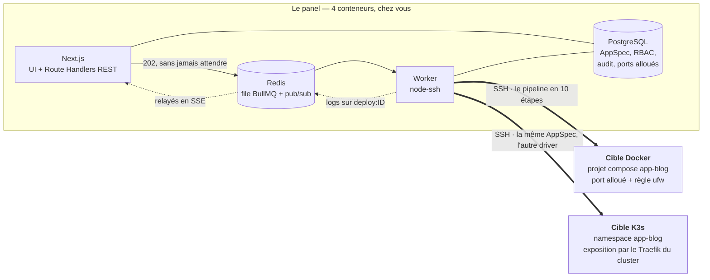

# Pupitre

**Un plan de contrôle auto-hébergé qui déploie vos applications sur vos machines,
par SSH, en Docker Compose *ou* en K3s — à partir de la même description.**

Vous écrivez une `AppSpec` : un JSON qui décrit *ce que* l'application est, et qui
ne connaît ni Docker ni Kubernetes. C'est le driver, au moment du déploiement, qui
la traduit en `compose.yml` ou en manifests Kubernetes. Changer de runtime, c'est
changer de machine cible — pas réécrire l'application.

Le reste — RBAC, journal d'activité, scans de vulnérabilités bloquants, rollback
automatique, supervision, notifications — existe parce qu'un outil qui détient vos
clés SSH n'a pas le droit d'être approximatif.

## En dix secondes

```json
{
  "name": "blog",
  "version": "1.4.2",
  "services": [
    {
      "name": "web",
      "source": { "type": "image", "ref": "ghcr.io/exemple/blog:1.4.2" },
      "port": 8080,
      "exposed": true,
      "env": { "DATABASE_HOST": "db", "DATABASE_NAME": "blog" },
      "secrets": ["DATABASE_PASSWORD"],
      "healthcheck": { "path": "/healthz", "retries": 5 },
      "resources": { "cpuMilli": 500, "memoryMi": 512 },
      "dependsOn": ["db"]
    },
    {
      "name": "db",
      "source": { "type": "image", "ref": "postgres:16-alpine" },
      "port": 5432,
      "exposed": false,
      "env": { "POSTGRES_DB": "blog", "POSTGRES_USER": "blog" },
      "secrets": [{ "name": "POSTGRES_PASSWORD", "from": "DATABASE_PASSWORD" }],
      "volumes": [
        { "name": "data", "mountPath": "/var/lib/postgresql/data", "size": "10Gi" }
      ]
    }
  ],
  "ingress": { "host": "blog.example.com", "tls": true, "targetService": "web" }
}
```

Aucun champ de ce fichier n'appartient à un runtime. Pas de `restart_policy`, pas
de `image_pull_policy`, pas de `namespace` : ce que la spec ne sait pas dire, le
driver le décide. Vous pouvez le vérifier sans déployer quoi que ce soit, ni même
posséder une machine :

```bash
pnpm tsx scripts/render-both.ts ma-spec.json
```

Sur cette spec-là, la sortie est un projet Compose `app-blog` de deux services, et
un namespace `app-blog` de dix manifests — `Namespace`, deux `ConfigMap`, deux
`Secret`, un `PersistentVolumeClaim`, deux `Deployment`, deux `Service`. Le domaine
`blog.example.com` n'est pas rendu par le driver : c'est une route, posée par le
reverse proxy de la cible au déploiement — un fichier pour Traefik sous Docker,
un `Ingress` pour celui de K3s.

Un détail qui n'en est pas un : `POSTGRES_PASSWORD` **est** `DATABASE_PASSWORD`.
Une application et sa base attendent souvent le même mot de passe sous deux noms ;
`from` dit « ce nom-ci désigne la valeur de ce nom-là ». Il n'y a qu'un secret,
qu'une ligne en base, qu'une valeur — et elle est chiffrée.

---

## Ce panel n'héberge rien. Il orchestre.

C'est la confusion la plus fréquente, alors autant la lever tout de suite : les
applications déployées ne vivent jamais dans le panel. Elles vivent sur les
machines cibles, et continueraient de tourner si le panel s'arrêtait.

|  | Le panel | Les machines cibles |
|---|---|---|
| Ce que c'est | 4 conteneurs sur votre poste ou un serveur d'admin | des VM ou serveurs que vous possédez déjà |
| Ce qui y tourne | Next.js, un worker, PostgreSQL, Redis | vos applications |
| Ce qu'il faut y installer | rien d'autre que Docker | rien — le panel installe ce dont il a besoin par SSH |
| Si on l'éteint | on ne peut plus déployer ni superviser | les applications continuent de répondre |

Le chemin d'un déploiement, du clic à l'URL :



Une route HTTP enfile et répond `202`. Elle n'attend jamais une session SSH.

---

## Démarrer

Prérequis : Docker (avec `compose`), et `jq` si vous comptez lancer les scripts
de vérification. Node et pnpm ne servent qu'au développement.

```bash
cp .env.example .env
docker compose up -d --build
```

Le panel applique les migrations, rejoue le seed RBAC, puis passe `healthy` ;
le worker ne démarre qu'ensuite. Ouvrez <http://localhost:3000> — la base est
vierge, donc l'inscription est ouverte et **le premier compte créé devient
administrateur**. Un assistant de démarrage vous prend en charge à la première
connexion : identité de l'instance, première cible, rôle, utilisateur, sécurité.

Contrôle :

```bash
docker compose ps                        # 4 conteneurs
curl -s http://localhost:3000/api/health # {"status":"ok","db":"ok","redis":"ok",...}
```

Pour autre chose qu'un essai local, régénérez les deux secrets avant le premier
démarrage — `MASTER_KEY` chiffre les credentials SSH et **ne peut pas être
changée après coup** sans rendre illisible tout ce qu'elle protège :

```bash
openssl rand -hex 32      # → MASTER_KEY
openssl rand -base64 48   # → BETTER_AUTH_SECRET
```

Pas de VM sous la main ? Le dépôt en fabrique deux, en conteneur :

```bash
./scripts/setup-test-target.sh   # cible Docker (docker-in-docker), enregistrée dans le panel
```

La cible K3s se monte à la main — voir [`docs/demarrage.md`](docs/demarrage.md#la-cible-k3s-de-test).

La suite du démarrage — mode développement, cibles de test, catalogue complet des
commandes — est dans **[`docs/demarrage.md`](docs/demarrage.md)**.

---

## Pourquoi celui-ci, plutôt qu'un autre

Pupitre appartient à la même famille que Coolify, Dokploy ou CapRover : un panel
que vous hébergez, qui déploie sur des machines que vous possédez. Il n'essaie pas
de les remplacer, et sur plusieurs points il leur est franchement inférieur. Voici
la comparaison telle qu'elle est.

**Ce qu'il fait et qu'on ne trouve pas dans cette famille**

| | |
|---|---|
| **Deux runtimes, une seule description** | La même AppSpec se déploie sur Docker Compose et sur K3s. Les panels de cette famille sont Docker — Compose ou Swarm ; Kubernetes est hors de leur périmètre. Ici, `pnpm test:parity` déploie la *même* spec des deux côtés, obtient deux URLs qui répondent à travers le reverse proxy de chaque cible, rollback et détruit — et il rend **32/32 au vert** (tableau plus bas). |
| **Le scan bloque, avant le déploiement** | Trivy, Grype et Syft tournent sur la machine cible dans le pipeline. Une politique `failOn: CRITICAL \| HIGH \| NONE`, stockée en donnée, arrête le déploiement à l'étape `scan`. Un SBOM est téléchargeable. |
| **RBAC granulaire et journal d'activité** | Trente-quatre permissions `ressource:action`, des rôles qui sont des **données** modifiables et non des constantes, et un journal d'activité écrit par un point d'entrée unique — refus de permission compris, avec l'IP réelle derrière le reverse proxy. |
| **Supervision et notifications intégrées** | Sondes HTTP et TLS avec hystérésis, métriques d'hôte avec seuils à trois niveaux, quatre canaux de notification. Pas d'outil séparé à brancher. |
| **Une AppSpec que l'IA remplit** | Une description en français produit un JSON validé par Zod — jamais du shell. Éditable avant déploiement. |

**Ce sur quoi il est en retrait, et de loin**

- **Pas de GitLab, et pas de prévisualisation par branche.** Pupitre suit une
  branche GitHub ou Gitea / Forgejo en l'interrogeant chaque minute — jamais de
  webhook : le panel reste privé — et accepte une archive du code pour une
  application sans dépôt. Ni GitLab, ni déploiement temporaire par pull
  request — voir la limite sur le contexte de build ci-dessous.
- **Aucun catalogue d'applications prêtes à l'emploi.** Là où Coolify propose des
  centaines de services en un clic, ici vous écrivez l'AppSpec.
- **Pas de gestion d'équipes ni de multi-tenance.** Un RBAC sur une instance,
  pas des espaces cloisonnés.
- **Aucune version publiée, aucune communauté.** Pas de tag, pas de release, pas
  d'image distribuée : une branche `main`. Les autres ont des milliers
  d'utilisateurs qui trouvent les bugs avant vous.

*Les capacités attribuées ci-dessus aux autres projets sont décrites à grands
traits, de bonne foi ; ils bougent vite, vérifiez chez eux.*

---

## Comment c'est construit

Les décisions sont dans **[`CLAUDE.md`](CLAUDE.md)**, qui est le document
d'autorité et se lit en cinq minutes. Ce qu'elles impliquent quand vous ouvrez
le code :

```
apps/web        Next.js 16 App Router — UI + Route Handlers REST
apps/worker     Process Node — consomme BullMQ, exécute par SSH
packages/db     Schéma Drizzle + migrations (source unique du modèle)
packages/core   AppSpec, RBAC, crypto, paramètres, queue — et quatre sous-chemins :
                  /ssh        node-ssh, preflight, métriques d'hôte
                  /drivers    DeploymentDriver + Docker + K3s
                  /scanners   Scanner + Trivy / Grype / Syft
                  /ai         génération d'AppSpec (Vercel AI SDK)
                  /probe      sondes HTTP et TLS de la supervision de sites
```

Les sous-chemins existent tous pour la même raison : `ssh2`, `nodemailer` et le
SDK IA ne doivent pas entrer dans le graphe de dépendances du panel Next. Les
*types* correspondants restent à la racine de `@pupitre/core`, parce que l'UI en a
besoin et qu'ils n'exécutent rien.

**Une seule image Docker, deux commandes au runtime : `web` et `worker`.**

Quatre conséquences qui expliquent la forme du code :

**Le driver ne sait rien du panel.** Il reçoit un `DriverContext`, il exécute, il
émet des lignes par un callback. Il n'importe ni `packages/db`, ni Redis. Même la
table `port_allocations` lui arrive derrière une interface `PortAllocator`. Si
vous cherchez « où le driver écrit en base », la réponse est : nulle part.

**Aucun `if (runtime === ...)` hors des drivers.** Le worker ne demande jamais
quel runtime il pilote, il demande ce que le driver sait faire : une étape est
`skipped` parce que la méthode a rendu `null` (`allocatePort()` en K3s), ou parce
qu'elle n'existe pas (`openFirewall?` non déclarée par `K3sDriver`). Vérifiable :

```bash
grep -rn "runtime === '" apps packages --include='*.ts' --include='*.tsx' \
  | grep -v /drivers/ | grep -v /dist/
```

Une seule ligne sort aujourd'hui, et elle mérite d'être nommée plutôt que
balayée : `packages/db/src/deployments.ts:1329` choisit le mot « namespace » ou
« projet Compose » dans un message destiné à un humain. Ce n'est pas une
divergence de comportement — aucun appel, aucun chemin d'exécution n'en dépend —
mais c'est bien du vocabulaire de runtime hors d'un driver, et la règle serait
plus propre si ce mot venait du driver lui-même.

**L'anti-collision de ports est une contrainte de base, pas un `if`.** On insère
dans `port_allocations (target_id, port)`, et une violation `23505` renvoie le
perdant au tirage suivant. Il n'y a pas de « SELECT puis INSERT » à trouver dans
le code, parce qu'il n'y en a pas.

**Tout ce qui est long passe par BullMQ.** Un déploiement, un preflight, un
relevé de métriques, un envoi de notification : la route HTTP enfile et répond
`202`, jamais elle n'attend une session SSH. La seule exception assumée est la
purge d'historique, qui est un `DELETE` en base et rien d'autre.

Le détail — les trois abstractions, l'AppSpec, le pipeline, les logs SSE, les
ports, UFW, le healthcheck, le rollback, la rétention — est dans
**[`docs/architecture.md`](docs/architecture.md)**.

---

## Ce que ça sait faire

| | Où c'est décrit |
|---|---|
| Machines cibles, preflight, charges distantes, suppression et purge | [`docs/exploitation.md`](docs/exploitation.md) |
| Reverse proxy (Traefik ou BunkerWeb repris ou installés, Nginx Proxy Manager connecté par son API), domaines et certificats Let's Encrypt au déploiement, tous les domaines et leurs échéances sur une page | [`docs/exploitation.md`](docs/exploitation.md#reverse-proxy-et-domaines) |
| Sauvegardes chiffrées vers S3, SFTP ou un dossier monté, restauration, reprise après sinistre | [`docs/exploitation.md`](docs/exploitation.md#sauvegardes) |
| Déployer depuis une CI (GitHub Actions, GitLab CI) avec un jeton d'API limité à ses applications | [`docs/exploitation.md`](docs/exploitation.md#déployer-depuis-une-ci) |
| Suivre une branche GitHub ou Gitea / Forgejo : son `pupitre.json` décrit l'application, chaque commit la met à jour ou la redéploie, et l'état revient sur le commit | [`docs/exploitation.md`](docs/exploitation.md#une-application-depuis-son-dépôt) |
| Le code d'une application sans dépôt : une archive téléversée, relue entrée par entrée et refaite propre avant de partir sur la machine | [`docs/exploitation.md`](docs/exploitation.md#le-code-dune-application-sans-dépôt) |
| RBAC (34 permissions), journal d'activité, chiffrement, magasin de secrets, comptes et TOTP | [`docs/securite.md`](docs/securite.md) |
| Second facteur exigé (droits sensibles ou tous les comptes), durée des sessions réglable | [`docs/securite.md`](docs/securite.md#le-second-facteur-exigé) |
| Connexion unique OpenID Connect (Keycloak, Authentik, Google, Entra), rôles tirés des groupes | [`docs/exploitation.md`](docs/exploitation.md#connexion-unique-par-keycloak) |
| Scanners Trivy / Grype / Syft et politique de blocage | [`docs/securite.md`](docs/securite.md#scanners-de-sécurité) |
| Sondes HTTP et TLS, métriques d'hôte, notifications, tâches planifiées | [`docs/supervision.md`](docs/supervision.md) |
| Génération d'AppSpec par IA, trois fournisseurs | [`docs/ia.md`](docs/ia.md) |
| Toutes les pages et toutes les routes d'API, avec leur permission | [`docs/api.md`](docs/api.md) |
| Tables et migrations | [`docs/base-de-donnees.md`](docs/base-de-donnees.md) |
| Les scripts de vérification et ce que chacun prouve | [`docs/verification.md`](docs/verification.md) |
| Le choix de chaque dépendance, et les deux montées refusées | [`docs/dependances.md`](docs/dependances.md) |
| Ce qui manque, et ce qu'il faudrait pour le lever | [`docs/feuille-de-route.md`](docs/feuille-de-route.md) |

---

## Limites connues

*État au 02/10/2026.* Ce qui suit n'est pas une note en bas de page : c'est un
tiers de ce fichier, et volontairement. Un README qui prétend à l'intemporalité
vieillit mal ; celui-ci est daté et le dit.

### Le critère d'architecture est exercé, et il passe

`CLAUDE.md` désigne un test comme « le test qui valide l'architecture » :
déployer **la même AppSpec** sur une cible Docker et une cible K3s, obtenir deux
URLs qui répondent, puis rollback des deux. Il n'a longtemps pas pu tourner :
`scripts/test-parity.ts` existait, sans cluster à viser.

La cible existe depuis le 12/09/2026 (`scripts/test-target-k3s/`, profil compose
`test`, k3s v1.33.4), et le test passe :

```
  Phase    Vérification                     docker   k3s
  ──────────────────────────────────────────────────────
  deploy   preflight()                      ✓       ✓
  deploy   allocatePort()                   ✓       ✓
  deploy   render()                         ✓       ✓
  deploy   upload()                         ✓       ✓
  deploy   build()                          ✓       ✓
  deploy   deploy()                         ✓       ✓
  deploy   healthcheck()                    ✓       ✓
  deploy   route posée sur le proxy         ✓       ✓
  deploy   l'URL répond                     ✓       ✓
  rollback rollback()                       ✓       ✓
  rollback santé après rollback             ✓       ✓
  rollback l'URL répond toujours            ✓       ✓
  destroy  destroy()                        ✓       ✓
  destroy  artefacts supprimés de la cible  ✓       ✓
  destroy  aucun port réservé en base       ✓       ✓
  destroy  aucun conteneur Docker restant   ✓       —
  destroy  namespace K3s disparu            —       ✓

  32/32 vérification(s) au vert
```

Les deux URLs passent par le **reverse proxy** de chaque cible — un Traefik en
conteneur côté Docker, celui du cluster côté K3s — : le domaine de la spec y est
posé comme route, vers l'amont que chaque driver annonce, exactement comme le
fait le pipeline. Une cible sans proxy est sondée par son port publié.

La fixture (`packages/core/src/spec/__fixtures__/parity.json`) n'est pas
complaisante : quatre services reliés par `dependsOn`, dont **deux construits
depuis un Dockerfile** — `front`, la porte d'entrée, et `api` en deux répliques
avec son Dockerfile dans un sous-répertoire — plus `redis` et `postgres` sur
étagère, deux volumes, deux secrets dont un alias, et un ingress TLS. L'URL qui
répond des deux côtés est servie par une image fabriquée sur la machine cible.

Trois choses valent d'être notées. Les phases de préparation sont identiques des
deux côtés — `preflight`, `allocatePort` (qui rend `null` en K3s, comme prévu),
`render`, `upload`. `destroy` est intégralement verte : artefacts nettoyés, port
rendu, namespace disparu. Et le port d'écoute des services construits est 8080 et
non 80, parce que nos images tournent en uid 1000 sans `CAP_NET_BIND_SERVICE` —
ce n'est pas un contournement du test, c'est la conséquence directe du
durcissement décrit plus bas.

### Le code d'un Dockerfile vient d'un dépôt ou d'une archive

Les deux drivers construisent une image depuis un Dockerfile, à partir d'un
contexte de build extrait dans `source/` de la release. Il arrive par deux
chemins : le **dépôt lié** à l'application (GitHub, Gitea, Forgejo), à son commit exact — voir
[`docs/exploitation.md`](docs/exploitation.md#une-application-depuis-son-dépôt) —,
ou, pour une application sans dépôt, une **archive téléversée** depuis sa fiche
ou par une CI — voir
[`docs/exploitation.md`](docs/exploitation.md#le-code-dune-application-sans-dépôt).

L'archive est bornée à 100 Mio (1 Gio décompressée), et seules les cinq
dernières de chaque application sont gardées : au-delà, une version reste dans
l'historique mais ne se redéploie plus. Un dépôt GitLab ne se suit pas encore.

### Compose ne sait pas publier un port derrière plusieurs répliques

Un service à `replicas: 2` reçoit `publishedPort: null` côté Docker : Compose ne
sait pas répartir un port publié entre deux conteneurs. Le Traefik de la machine
le joignant par ce port, un tel service n'est donc pas joignable depuis
l'extérieur en Docker — alors qu'il l'est en K3s, où un Service ClusterIP fait
exactement ce travail.

C'est une capacité manquante du runtime, pas un défaut du driver, et c'est la
seule asymétrie fonctionnelle qui subsiste entre les deux. La fixture de parité
la contourne en n'exposant que son service à réplique unique.

### Comment une image se construit sans registry

Le problème est réel et il a longtemps été une limite : un node K3s fait tourner
containerd, pas Docker, et le projet a écarté l'usage d'un registry. `k3s ctr`
sait importer une image, pas la construire.

La réponse est **BuildKit en pod, worker OCI**, dont la sortie est un tar OCI
importé par `k3s ctr -n k8s.io images import -`. Le namespace `k8s.io` est le
point qui casse tout s'il change : c'est là que le kubelet cherche ses images.
Le tar transite par `kubectl exec`, ne touche jamais le disque du nœud et ne sort
jamais de la machine.

Le worker **containerd** de BuildKit serait plus élégant — l'image atterrirait
directement au bon endroit, sans tar. Il a été essayé en premier et il échoue :
ses étapes `RUN` sont exécutées par le shim containerd, qui tourne sur l'hôte, et
le faire fonctionner exige de propager des montages depuis le pod. Le kubelet
refuse alors le pod, `path "/var/lib/buildkit" is mounted on "/" but it is not a
shared mount`. Le worker OCI fait tourner `runc` **dans** le pod : rien à
propager, aucun hostPath, aucune hypothèse sur la topologie de montage du nœud.

Ce que ça laisse : le constructeur reste en place entre deux builds, parce que
son cache de couches vit dedans. C'est un pod privilégié qui attend sur le
cluster, volontairement dépourvu d'étiquette `managed-by` pour rester supprimable
depuis l'écran des charges, et la commande pour s'en défaire est journalisée à
chaque build. Rien ne le supprime automatiquement.

Un refus, lui, tombe désormais au **preflight** et non plus à l'étape `build` :
le contrôle `image_build` soumet le constructeur au cluster en `--dry-run=server`
et prend sa réponse. Avant, le refus arrivait après `upload`, donc après avoir
déposé les manifests sur la machine — Secrets rendus compris, en clair, pour un
déploiement qui n'aurait jamais lieu.

### Trois reverse proxies, pas plus

Traefik, BunkerWeb (avec son pare-feu applicatif) et Nginx Proxy Manager sont
pilotés et éprouvés de bout en bout contre un vrai serveur ACME de test
(`pnpm test:proxy`, `pnpm test:npm`). Restent hors de portée : BunkerWeb dans un
cluster K3s, l'installation de Nginx Proxy Manager par Pupitre, et les
certificats jokers, qui demandent le défi DNS-01. Voir
[`docs/exploitation.md`](docs/exploitation.md#reverse-proxy-et-domaines).

### Pas de clé d'IA sur cette instance

`OPENROUTER_API_KEY` et ses équivalents OpenAI / Anthropic ne sont pas renseignés.
La chaîne de génération est couverte de bout en bout par des tests unitaires sous
modèle simulé (`packages/core/test/ai.test.ts`), et `verify-ai.sh` saute
proprement ce qui exige un vrai fournisseur, en le disant. Personne n'a donc vu
un vrai modèle répondre sur cette instance.

### Détails plus petits, mais réels

- **Trivy ne verra pas les images construites sur K3s.** Il cherche containerd
  sur `/run/containerd/containerd.sock`, namespace `default` ; k3s écoute sur
  `/run/k3s/containerd/containerd.sock`, namespace `k8s.io`. L'étape de scan rend
  donc `unknown` — non bloquant, mais silencieusement inutile. Deux variables
  d'environnement dans `packages/core/src/scanners/trivy.ts` suffiraient.
- **Le compteur de limitation de débit de l'authentification est en mémoire**,
  donc par processus. Correct pour un panel mono-conteneur, faux dès qu'on en
  met deux derrière un répartiteur. Celui du panel, lui, vit déjà dans Redis.
- **`MASTER_KEY` ne se fait pas tourner.** Le format
  `version:iv:authTag:ciphertext` existe pour le permettre un jour ; le code de
  rotation n'est pas écrit.

Ce qu'il faudrait pour lever chacun de ces points est dans
[`docs/feuille-de-route.md`](docs/feuille-de-route.md).

---

## Contribuer

Le français est la langue du projet. Un système FR/EN pour l'interface est prévu ;
il n'existe pas encore.

- **[`CONTRIBUTING.md`](CONTRIBUTING.md)** — à lire avant la première pull
  request : les trois abstractions, la règle d'immuabilité des migrations, ce que
  la revue regarde.
- **[`CLAUDE.md`](CLAUDE.md)** — le contrat d'architecture. Cinq minutes, et il
  fait autorité.
- **[`SECURITY.md`](SECURITY.md)** — signaler une faille. Pas par une issue.
- **[`CODE_OF_CONDUCT.md`](CODE_OF_CONDUCT.md)** — *Contributor Covenant* v2.1.

## Licence

**GNU AGPL v3 ou ultérieure** — voir [`LICENSE`](LICENSE).
Copyright © 2026 les contributeurs de Pupitre.

Pupitre est un logiciel qu'on utilise par le réseau : c'est un panel, on s'y
connecte, on ne le distribue jamais. Sous une licence permissive, quelqu'un
pourrait le proposer en service hébergé sans jamais rien rendre. L'article 13 de
l'AGPL est précisément ce qui l'empêche : si vous modifiez Pupitre et que vous en
donnez l'accès à des utilisateurs par un réseau, ils ont droit à vos sources.

Ce que cela n'impose pas : les applications que vous déployez **avec** Pupitre ne
sont pas des œuvres dérivées de Pupitre. Vous restez libre de déployer ce que vous
voulez, sous la licence que vous voulez.

Ce que cela coûte, dit franchement : l'AGPL ferme la porte à l'intégration dans un
produit propriétaire, et beaucoup d'entreprises l'interdisent par politique
interne. C'est un choix assumé — protéger le retour des contributions a paru plus
important que l'adoption la plus large possible pour un outil qui détient les clés
SSH de ses utilisateurs.
